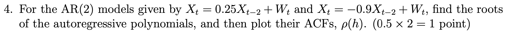
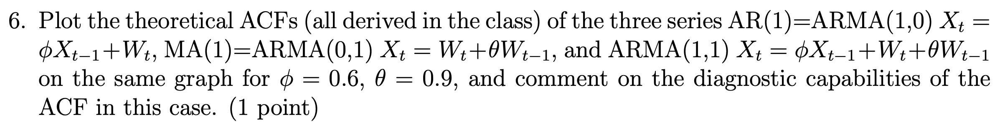
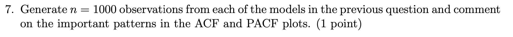

# Setup

```{r setup, include=TRUE, message=FALSE}
knitr::opts_chunk$set(echo = TRUE)

# Load the required packages
library(ggplot2)
library(astsa)
library(dplyr)
library(tidyr)
```

# Problem 4



## AR(2) Model: $X_t =.25X_{t-2} + W_t$

$$
\rho(h) = \frac{[1+(-1)^h]}{2^{h+1}}; h\ge 1
$$

```{r}
# Define the function to compute and plot ACF for AR(2)
compute_ACF_AR2_1 <- function(lag.max) {
  lags <- seq(from = 0, to = lag.max)
  
  # Function to compute ACF for each lag
  compute_acf <- function(h) {
    if (h == 0) return(1)
    acf <- (1+(-1)^h)/(2^(h+1))
    return(acf)
  }
  
  # Compute ACF for all lags
  acfs <- sapply(lags, compute_acf)
  
  # Create a data frame for plotting
  acf_data <- data.frame(Lag = lags, ACF = acfs)
  
  # Create the ggplot
  ggplot(acf_data, aes(x = Lag, y = ACF)) +
    geom_hline(yintercept = 0, color = "black") + # Line at y = 0
    geom_bar(stat = "identity", fill = "black", width = 0.2) + # Bar plot for ACF values
    labs(
      title = expression(paste("ACF of AR(2) Process: ", X[t], " = 0.25", X[t-2], " + ", W[t])),
      x = "Lag",
      y = "ACF"
    ) +
    theme_minimal() + # Minimal theme for a clean look
    theme(
      plot.title = element_text(hjust = 0.5, face = "bold", size = 14), # Centered and bold title
      axis.title.x = element_text(size = 12), # X-axis label size
      axis.title.y = element_text(size = 12)  # Y-axis label size
    )
}

# Call the function with lag.max = 25
compute_ACF_AR2_1(25)
```

## AR(2) Model: $X_t =-0.9X_{t-2} + W_t$

$$
\rho(h) = 0.9^{\frac{h}{2}}cos(h \frac{\pi}{2}); h\ge1
$$

```{r}
# Define the function to compute and plot ACF for AR(2)
compute_ACF_AR2_2 <- function(lag.max) {
  lags <- seq(from = 0, to = lag.max)
  
  # Function to compute ACF for each lag
  compute_acf <- function(h) {
    if (h == 0) return(1)
    acf <- (0.9^(h/2))*cos(h*pi/2)
    return(acf)
  }
  
  # Compute ACF for all lags
  acfs <- sapply(lags, compute_acf)
  
  # Create a data frame for plotting
  acf_data <- data.frame(Lag = lags, ACF = acfs)
  
  # Create the ggplot
  ggplot(acf_data, aes(x = Lag, y = ACF)) +
    geom_hline(yintercept = 0, color = "black") + # Line at y = 0
    geom_bar(stat = "identity", fill = "black", width = 0.2) + # Bar plot for ACF values
    labs(
      title = expression(paste("ACF of AR(2) Process: ", X[t], " = 0.25", X[t-2], " + ", W[t])),
      x = "Lag",
      y = "ACF"
    ) +
    theme_minimal() + # Minimal theme for a clean look
    theme(
      plot.title = element_text(hjust = 0.5, face = "bold", size = 14), # Centered and bold title
      axis.title.x = element_text(size = 12), # X-axis label size
      axis.title.y = element_text(size = 12)  # Y-axis label size
    )
}

# Call the function with lag.max = 25 
compute_ACF_AR2_2(25)
```

\newpage

# Problem 6



ACF of ARMA(1,1):

$$
\rho(h) = \frac{(1+\theta \phi)(\phi + \theta)}{1+2\theta \phi + \theta^2} \phi^{h-1}; h\ge1
$$

ACF of AR(1) can be obtained by putting $\theta = 0$ in the above formula.

ACF of MA(1) can be obtained by putting $\phi = 0$ in the above formula.

```{r}
compute_ACF_ARMA <- function(phi, theta, lag.max) {
  lags <- seq(from=0, to=lag.max)
  compute_acf <- function(h) {
    if(h==0) return(1)
    acf <- ((phi^(h-1))*(1+theta*phi)*(phi+theta))/(1+2*theta*phi+theta*theta)
    return(acf)
  }
  acfs <- sapply(lags, compute_acf)
  return(acfs)
}

# Generate ACF values for the models
u1 <- compute_ACF_ARMA(0.6, 0.9, lag.max=10)
u2 <- compute_ACF_ARMA(0.6, 0, lag.max=10)
u3 <- compute_ACF_ARMA(0, 0.9, lag.max=10)

# Create a data frame for ggplot
df <- data.frame(
  Lag = 0:10,
  ARMA = u1,
  AR = u2,
  MA = u3
) %>%
  pivot_longer(cols = c("ARMA", "AR", "MA"), names_to = "Model", values_to = "ACF")

# Plot using ggplot
ggplot(df, aes(x = Lag, y = ACF, color = Model)) +
  geom_line(aes(linetype = Model)) +
  geom_point() +
  labs(title = "ACF of ARMA, AR, and MA Models", x = "Lag", y = "ACF") +
  scale_color_manual(values = c("black", "red", "blue")) +
  theme_minimal() +
  theme(legend.position = "top")
```

\newpage

# Problem 7



## AR(1) Process

```{r}
ar = arima.sim(list(order=c(1,0,0), ar=.6), n=1000)
acf2(ar, main="ACF and PACF for AR(1) process")
```

### Comments on **AR(1)**:

-   **ACF**: The ACF plot shows a gradual decrease or tapering off of the autocorrelation coefficients as the lag increases. This pattern is characteristic of an autoregressive (AR) process, where the current value of the series is dependent on its past values.

-   **PACF**: The PACF plot exhibits a sharp cutoff after the first lag, indicating that the partial autocorrelations beyond the first lag are effectively zero. This is a typical signature of an AR(1) or first-order autoregressive process, where the current value of the series is linearly dependent only on the immediately preceding value.

## MA(1) Process

```{r}
ma = arima.sim(list(order=c(0,0,1), ma=.9), n=1000)
acf2(ma, main="ACF and PACF for MA(1) process")
```

### Comments on **MA(1)**:

-   **ACF**: The ACF plot exhibits a sharp cutoff after the first lag, with the autocorrelation coefficients becoming effectively zero beyond this point. This pattern is characteristic of a moving average (MA) process, where the current value of the series is dependent on the immediate past random shocks or errors.

-   **PACF**: The PACF plot shows a gradual tapering off of the partial autocorrelation coefficients as the lag increases. This behavior is consistent with an MA process, where the current value depends linearly on the immediately preceding random shock or error term.

## ARMA(1,1) Process

```{r}
arma = arima.sim(list(order=c(1,0,1), ar=.6, ma=.9), n=1000)
acf2(arma, main="ACF and PACF for ARMA(1,1)")
```

### Comments on **ARMA(1,1)**:

-   **ACF**: The ACF plot shows a gradual tapering off of the autocorrelation coefficients as the lag increases. This pattern is characteristic of a combined autoregressive and moving average (ARMA) process, where the current value of the series is dependent on both its past values and past random shocks or errors.

-   **PACF**: The PACF plot also exhibits a gradual decline in the partial autocorrelation coefficients as the lag increases. This behavior is consistent with an ARMA process, where the current value depends linearly on both its own past values and the immediately preceding random shocks or error terms.
